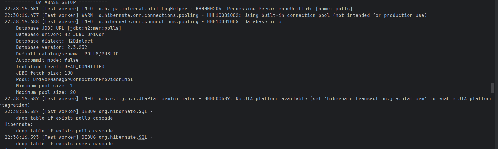
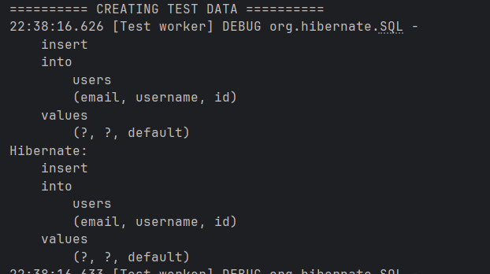
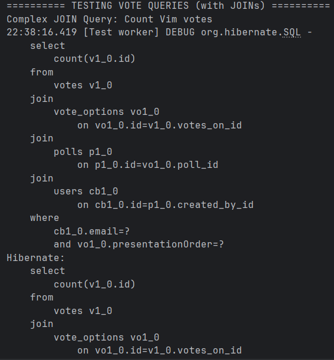
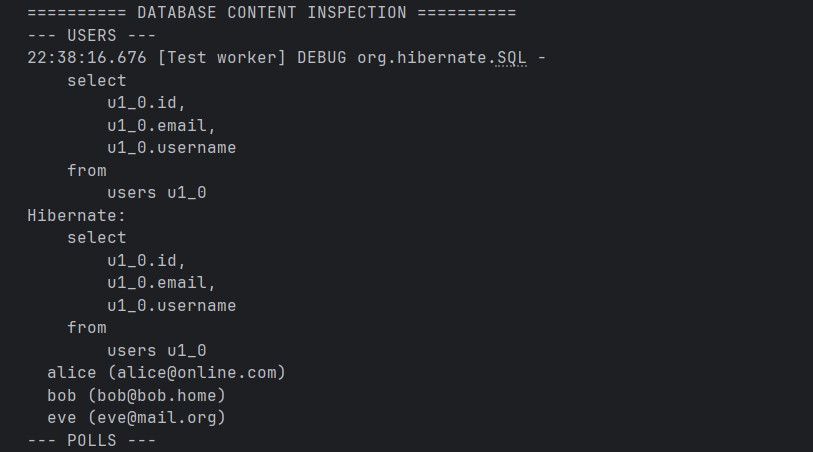

# JPA Implementation Report

## Initial Challenges
One problem with the guide was that i did not know to make new files or use the ones i had.
I ended up making new to fit the JPA and adding the test. The code was not a porblem, but had a little bit problems understanding how it all fit together.
It has become queite a "messy" file system i thing know. I would like some tips for that in the guide.

## Database Schema Analysis

For the database: The @Id and @GeneratedValue annotations on the id field in each class tell JPA to create a primary key for each table and to have the database automatically generate a unique value for it.
The @OneToMany and @ManyToOne annotations define the relationships between the tables, and JPA uses this information to create the foreign key constraints to maintain data integrity.

### Table Descriptions

**users table**: Created from User.java. This table would have columns for id, username, and email, as defined in the class. The @Column(unique = true) annotation on the username field tells JPA to create a unique constraint on the corresponding column in the table.

**polls table**: Created from Poll.java. This table would have columns for id, question, publishedAt, and validUntil. It would also have a foreign key column named created_by_id to link back to the users table, as specified by the @ManyToOne and @JoinColumn annotations.

**vote_options table**: This table would contain id, caption, and presentationOrder columns. It would also have a foreign key column named poll_id to link to the polls table.

**votes table**: Created from Vote.java. This table would have id, and votedAt columns, as well as foreign key columns voted_by_id and votes_on_id to link back to the users and vote_options tables, respectively.

## SQL Monitoring During Tests

To observe what happens in the database during testing, I enabled SQL logging in the test configuration and added console output to track different phases of database operations.

### Configuration for SQL Monitoring

The following properties were added to the test setup to enable comprehensive SQL logging:

```java
.property("hibernate.show_sql", "true")
.property("hibernate.format_sql", "true")
.property("hibernate.use_sql_comments", "true")
```

### Database Schema Creation

When the tests run, Hibernate first drops any existing tables and then creates new ones based on the JPA annotations:



*Screenshot showing the DDL (Data Definition Language) statements generated by Hibernate to create the database schema*

Key observations:
- Tables are created with proper primary keys using `bigint generated by default as identity`
- Foreign key columns are created (e.g., `created_by_id`, `poll_id`, `voted_by_id`)
- Unique constraints are applied where specified in annotations
- Proper data types are chosen based on Java field types

### Data Insertion Process

During the test setup phase, entities are persisted to the database:



*Screenshot showing INSERT statements generated when persisting User, Poll, VoteOption, and Vote entities*

The ORM automatically:
- Generates INSERT statements for each entity
- Handles foreign key relationships correctly
- Assigns auto-generated IDs
- Manages the order of insertions to respect foreign key constraints

### Complex Query Execution

The tests execute complex JPQL queries that demonstrate how the ORM handles joins:



*Screenshot showing JOIN queries generated from JPQL for counting votes with multiple table relationships*

Notable features:
- JPQL is translated into proper SQL JOIN syntax
- Parameter binding is handled securely (using `?` placeholders)
- Complex multi-table relationships are navigated correctly
- The ORM optimizes query structure for the H2 database dialect

### Database Content Verification

Finally, the tests verify the data was correctly stored:



*Screenshot showing the final state of all entities retrieved from the database*

This demonstrates that:
- All relationships are properly maintained
- Data integrity is preserved
- Entity objects are correctly reconstructed from database records

## Technical Implementation Notes

### Entity Relationships
- **User → Poll**: One-to-Many (user can create multiple polls)
- **Poll → VoteOption**: One-to-Many (poll can have multiple options)
- **User → Vote**: One-to-Many (user can cast multiple votes)
- **VoteOption → Vote**: One-to-Many (option can receive multiple votes)

### Key JPA Features Demonstrated
1. **Entity Mapping**: `@Entity`, `@Table`, `@Id`, `@GeneratedValue`
2. **Relationships**: `@OneToMany`, `@ManyToOne`, `@JoinColumn`
3. **Constraints**: `@Column(unique = true)`
4. **Cascading**: `CascadeType.ALL` for automatic persistence of related entities
5. **Fetch Strategies**: `FetchType.LAZY` for performance optimization

## Project Organization
Felt it was better to do this in the same repo as expass2. No pending issue.

## Screenshots Directory Structure
```
screenshots/
├── schema-creation.png
├── data-insertion.png
├── complex-queries.png
└── database-content.png
```