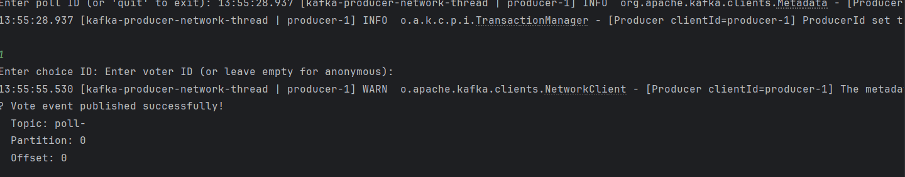

# DAT250: Software Technology Experiment Assignment 6

## Overview

This assignment focuses on integrating Apache Kafka message broker with the existing Poll application to implement event sourcing functionality. The goal was to create topics for each poll and handle voting events through Kafka messaging.

## Technical Implementation

### Architecture Choices

**Message Broker**: Apache Kafka was chosen for this implementation:
- I already know how to use

### Key Components Implemented

1. **Kafka Configuration** (`config/KafkaConfig.java`)
    - Producer and consumer factory configurations
    - JSON serialization/deserialization setup
    - AdminClient for topic management

2. **Event Classes** (`events/VoteEvent.java`, `events/PollCreatedEvent.java`)
    - Structured event representations
    - JSON serialization support
    - Timestamp tracking

3. **Kafka Service** (`service/KafkaService.java`)
    - Topic creation for new polls
    - Event publishing functionality
    - Error handling and logging

4. **Event Listener** (`service/KafkaEventListener.java`)
    - Automatic subscription to poll topics
    - Event processing and database updates
    - Support for different event types

5. **Integration Updates**
    - Modified `Pollmanager` to integrate with Kafka
    - Updated controllers to publish events
    - Enhanced voting workflow

### Event Flow

1. **Poll Creation**: When a new poll is created via REST API
    - A Kafka topic `poll-{pollId}` is automatically created
    - A `PollCreatedEvent` is published to the general `poll-events` topic

2. **Voting Process**:
    - Votes through REST API publish `VoteEvent` to the poll-specific topic
    - External applications can publish vote events directly to topics
    - The application listens to all poll topics and processes events
    - Valid events trigger database updates

3. **Anonymous Voting**:
    - Support for anonymous voters through Kafka events
    - Voter ID generation for anonymous participants

## Testing Setup

### Local Kafka Setup
Withh docker. added a docker compose to start kafka server with it.

### Testing Scenarios

1. **REST API Integration Test**:
    - Created polls through `/users/{userId}/polls`
    - Verified topic creation in Kafka
    - Submitted votes via `/users/{userId}/votes`
    - Confirmed event publishing and processing

2. **Standalone Kafka Client Test**:
    - Developed `StandaloneKafkaTest.java` for direct Kafka interaction
    - Published vote events directly to poll topics
      
    - Verified the application received and processed external events
    - Tested consumer functionality for monitoring events
   
    Output for listen for poll events.
   ```
    === Event Consumer ===
    Enter topic name to subscribe to (e.g., 'poll-123' or 'poll-events'): 1
    13:57:39.872 [main] INFO  o.a.k.c.c.i.ClassicKafkaConsumer - [Consumer clientId=consumer-standalone-test-group-1, groupId=standalone-test-group] Subscribed to topic(s): 1
    Listening for events on topic: 1
    Press Ctrl+C to stop...
    
    13:57:40.861 [main] WARN  o.apache.kafka.clients.NetworkClient - [Consumer clientId=consumer-standalone-test-group-1, groupId=standalone-test-group] The metadata response from the cluster reported a recoverable issue with correlation id 2 : {1=UNKNOWN_TOPIC_OR_PARTITION}
    13:57:40.863 [main] INFO  org.apache.kafka.clients.Metadata - [Consumer clientId=consumer-standalone-test-group-1, groupId=standalone-test-group] Cluster ID: op6wBXg5RX6O-jxsotUXNw
    13:57:40.863 [main] INFO  o.a.k.c.c.i.ConsumerCoordinator - [Consumer clientId=consumer-standalone-test-group-1, groupId=standalone-test-group] Discovered group coordinator 127.0.0.1:9092 (id: 2147483647 rack: null)
    13:57:40.881 [main] INFO  o.a.k.c.c.i.ConsumerCoordinator - [Consumer clientId=consumer-standalone-test-group-1, groupId=standalone-test-group] (Re-)joining group
    13:57:40.937 [main] INFO  o.a.k.c.c.i.ConsumerCoordinator - [Consumer clientId=consumer-standalone-test-group-1, groupId=standalone-test-group] Request joining group due to: need to re-join with the given member-id: consumer-standalone-test-group-1-86916c94-4089-46db-a7d0-a7ad2333837b
    13:57:40.938 [main] INFO  o.a.k.c.c.i.ConsumerCoordinator - [Consumer clientId=consumer-standalone-test-group-1, groupId=standalone-test-group] (Re-)joining group
    13:57:44.185 [main] INFO  o.a.k.c.c.i.ConsumerCoordinator - [Consumer clientId=consumer-standalone-test-group-1, groupId=standalone-test-group] Successfully joined group with generation Generation{generationId=3, memberId='consumer-standalone-test-group-1-86916c94-4089-46db-a7d0-a7ad2333837b', protocol='range'}
    13:57:44.206 [main] INFO  o.a.k.c.c.i.ConsumerCoordinator - [Consumer clientId=consumer-standalone-test-group-1, groupId=standalone-test-group] Finished assignment for group at generation 3: {consumer-standalone-test-group-1-86916c94-4089-46db-a7d0-a7ad2333837b=Assignment(partitions=[1-0])}
    13:57:44.226 [main] INFO  o.a.k.c.c.i.ConsumerCoordinator - [Consumer clientId=consumer-standalone-test-group-1, groupId=standalone-test-group] Successfully synced group in generation Generation{generationId=3, memberId='consumer-standalone-test-group-1-86916c94-4089-46db-a7d0-a7ad2333837b', protocol='range'}
    13:57:44.226 [main] INFO  o.a.k.c.c.i.ConsumerCoordinator - [Consumer clientId=consumer-standalone-test-group-1, groupId=standalone-test-group] Notifying assignor about the new Assignment(partitions=[1-0])
    ```

3. **Event Sourcing Validation**:
    - Confirmed all voting actions create corresponding events
    - Verified database consistency with event stream
    - Tested event replay capabilities

## Technical Problems Encountered

### 1. Scan

**Problem**: Have a problem with the test cant run both (option 3), but can run 1 by 1 so thats alrigth
